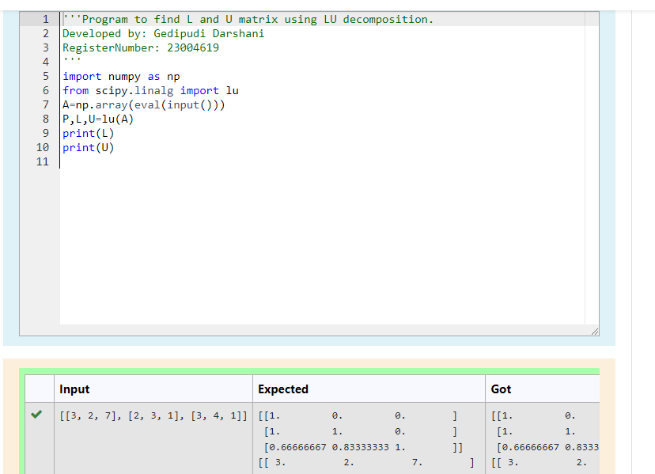
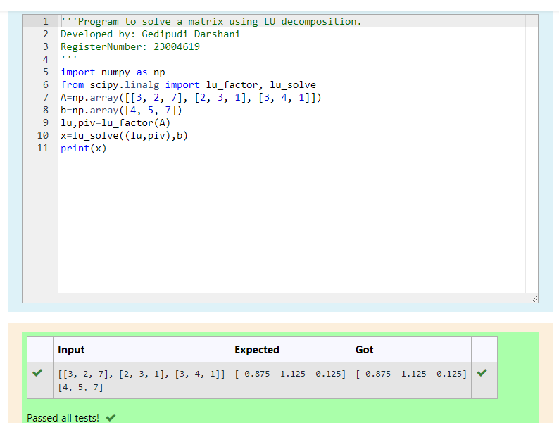

# LU Decomposition 

## AIM:
To write a program to find the LU Decomposition of a matrix.

## Equipments Required:
1. Hardware – PCs
2. Anaconda – Python 3.7 Installation / Moodle-Code Runner

## Algorithm
(i)

1. Import the numpy module to use the built-in functions  scipy.linalg for calculation.

2. Prepare the lists from given matrix and assign in np.array()

3. Using the np.array(eval(input()))

4. End the program.

(ii)

 1.Import the numpy module to use the built-in functions  scipy.linalg for calculation.
 
 2.Prepare the lists from the given matrix and assign in np.array()


 3.Import lu_factor and lu_solve from scipy.linalg      

 4.Using lu,piv to find lu_factor and lu_solve to solve the matrix.

 5.End the program.

  


## Program:
(i) To find the L and U matrix
```
/*
Program to find the L and U matrix.
Developed by: Gedipudi Darshani 
RegisterNumber: 23004619
import numpy as np
from scipy.linalg import lu
A=np.array(eval(input()))
P,L,U=lu(A)
print(L)
print(U)
*/
```
(ii) To find the LU Decomposition of a matrix
```
/*
Program to find the LU Decomposition of a matrix.
Developed by: Gedipudi Darshani
RegisterNumber:23004619
import numpy as np
from scipy.linalg import lu_factor, lu_solve
A=np.array([[3,2,7],[2,3,1],[3,4,1]])
b=np.array([4,5,7])
lu,piv=lu_factor(A)
x=lu_solve((lu,piv),b)
print(x)
*/
```

## Output:




## Result:
Thus the program to find the LU Decomposition of a matrix is written and verified using python programming.

